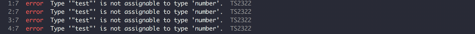
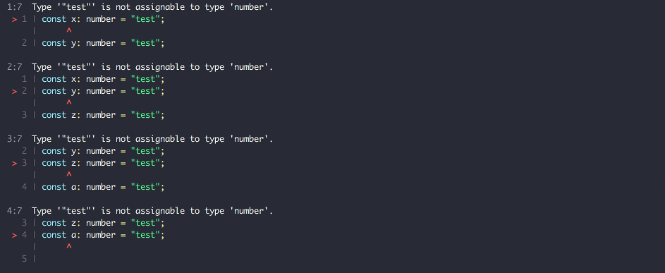

# ts-diagnostic-formatter
[![Build Status Linux][build-travis-badge]][build-travis] [![Build Status Windows][build-appveyor-badge]][build-appveyor] [![codecov][codecov-badge]][codecov]

A collection of custom formatter for TypeScript Diagnostics.

## Installation

Install ts-diagnostic-formatter via NPM as usual:

```sh
$ npm install ts-diagnostic-formatter --save-dev
```

## Usage

```typescript
import diagnosticFormatter from "ts-diagnostic-formatter";
const formatter =  "ts-loader"; // or stylish/codeframe
const contextPath = process.cwd();
const formattedDiagnostics = diagnosticFormatter(diagnostics, formatter, contextPath);
```

## Included formatters

### ts-loader


### stylish



### codeframe




## License

MIT


[build-travis-badge]: https://travis-ci.org/zinserjan/ts-diagnostic-formatter.svg?branch=master
[build-travis]: https://travis-ci.org/zinserjan/ts-diagnostic-formatter
[build-appveyor-badge]: https://ci.appveyor.com/api/projects/status/swjbs9vq1l9yy4v9/branch/master?svg=true
[build-appveyor]: https://ci.appveyor.com/project/zinserjan/ts-diagnostic-formatter
[codecov-badge]: https://codecov.io/gh/zinserjan/ts-diagnostic-formatter/branch/master/graph/badge.svg
[codecov]: https://codecov.io/gh/zinserjan/ts-diagnostic-formatter
